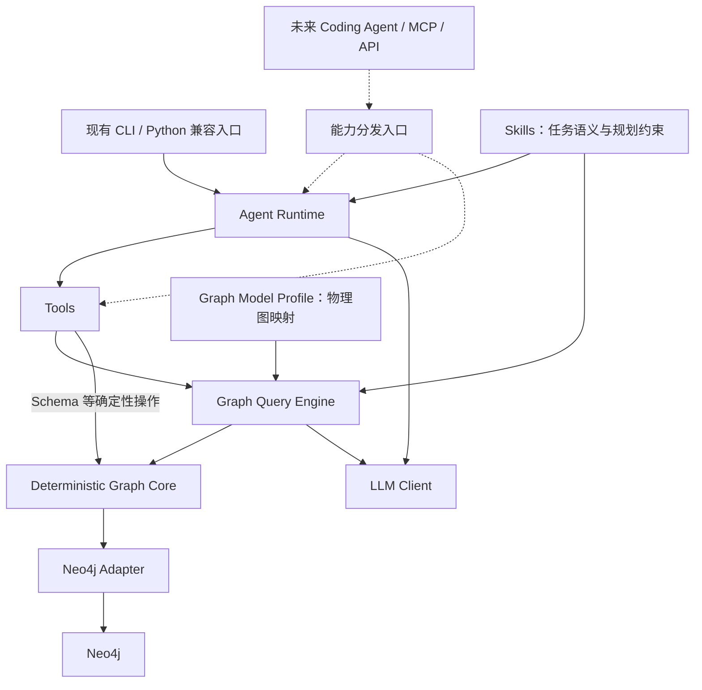

# 面向 Coding Agent 的代码图谱查询架构重构计划

记录日期：2026-09-05。分析基准：`error-recovery@35deb94`。

本文保存已确认的重构方案，并作为后续实施的阶段基线。各阶段均需遵循“阅读相关实现、形成阶段计划、编写代码、验证、独立提交”的顺序。

实施状态：P0“冻结真实基线”、P1“抽取安全执行入口”、P2“抽取单次 Query Engine”、P3“组织 Skills 与 Graph Profile”和 P4“抽取 Runtime 与内部 Tools”已完成；P5 尚未开始。

## 一、结论与本轮边界

建议采用**保留现有行为、逐步抽取职责、最后替换内部装配**的方式重构。

当前项目已经具备可以复用的查询、安全、恢复和评测基础，不需要重新建设一套 Agent 框架。真正需要调整的是：把目前以 `Text2CypherPipeline` 为中心的组织方式，改为以“任务规划、单次图查询、领域知识、安全执行”四个明确边界组织。

按照已确认的范围：

- **本轮实施目标**：完成结构重构，保持现有单轮查询、Prompt、查询语义、恢复策略、CLI 和公开 Python 接口兼容。
- **后续改进目标**：实体解析、确定性专项查询、结果依赖、迭代规划、Agent/Tool Recovery。
- **远期接入目标**：通过 MCP/API 服务外部 Coding Agent；本轮不增加服务器、协议依赖或占位接口。
- 服务单实例、单个代码图谱；图谱构建、索引更新由外部系统负责。

下文中的“本轮”指未来按本文实施的结构重构轮次；当前保存文档的任务不包含任何实施工作。

以下依据 `error-recovery@35deb94` 的实现、测试、evaluation、现有设计文档及论文整理。方案分析期间没有修改代码。已执行的离线验证为：

| 检查 | 结果 |
|---|---|
| pytest | 422 passed，16 skipped |
| Ruff | 通过 |
| Mypy | 60 个源文件通过 |
| 真实 Neo4j/LLM 验收 | 本次未执行 |
| 当前 HEAD 完整语义评测 | 未发现可作为正式基线的完整报告 |

因此，“离线测试通过”和“当前查询语义质量已经达标”必须分别描述。

## 二、当前架构与主要技术债

### 2.1 当前生产链路

实际链路是：

```text
CLI
  → Bootstrap
  → Text2CypherPipeline
      → 获取一次 Schema
      → Primary Agent 生成单轮计划
      → 顺序执行 1～3 个独立子查询
          → Few-shot Router
          → PromptBuilder
          → LLM 生成 Cypher
          → Parser
          → Validator：本地限制 + Neo4j EXPLAIN
          → Executor
          → 可选 Cypher Correction / 空结果复核
      → 一次结果总结
      → Formatter
```

几个影响重构设计的实际约束：

1. Schema 在规划前获取，但不传给当前 Primary Agent。
2. 子查询顺序执行，不传递结果、不跨结果集 JOIN；任一子查询失败，整题失败。
3. Primary Agent 已经承担高层规划。旧 `LLMQuestionDecomposer` 是兼容包装器，旧 Reviewer 不在生产路径中。
4. `QueryShape` 包含九种枚举值，已经影响规划校验、规则选择、Few-shot 和模板选择，但尚不是完整查询 IR。
5. 当前有 26 条 Few-shot、九个业务规则模块，以及一个实际启用的完整下游链结构模板。
6. 结构模板仍然交给 LLM 填写，不是确定性 Cypher 编译器。

主要依据：[Pipeline](../src/text2cypher/application/pipeline.py)、[旧 Decomposer 适配器](../src/text2cypher/application/question_decomposer.py)、[QueryShape](../src/text2cypher/domain/query_shapes.py)。

### 2.2 技术债及其影响

| 技术债 | 当前表现 | 对最终目标的影响 |
|---|---|---|
| 编排职责集中 | Pipeline 同时规划、翻译、执行、恢复、总结、格式化 | 难以单独提供一次图查询，也难加入 Observe/Replan |
| 领域知识归属混杂 | Business Rules、Primary Prompt、Parser 启发式、QueryShape、Few-shot 分别包含语义判断 | 修改一种查询语义需要同步多处，容易发生冲突 |
| 模型与职责命名耦合 | 查询引擎需要消费 `PrimaryAgentQuery`；响应中包含 `formatted` | 引擎依赖规划器命名，领域响应依赖 CLI 展示 |
| 安全边界依赖调用纪律 | Executor 本身允许直接执行，安全性依赖上层先调用 Validator | 新增 Tool 时容易绕过既有安全链 |
| 参数契约不完整 | Executor 支持参数，Validator 接口没有参数 | 尚不适合直接承接确定性参数化 Tools |
| 恢复策略散落 | Pipeline 包含错误分类、纠错、空结果替换及日志逻辑 | 难以统一描述预算和恢复边界 |
| 装配重复 | production bootstrap 与 evaluation 分别装配服务 | 可能“评测的系统”和“实际运行的系统”配置不同 |
| 观测绑定实现细节 | evaluation 依赖包装器、日志事件及部分模块名称 | 类或目录迁移可能改变指标，而实际行为没有变化 |
| 通用组件依赖资源基础设施 | 模板组件复用 Few-shot JSON loader 的内部校验能力 | 组件与基础设施之间的依赖方向不清晰 |
| 文档和基线漂移 | 文档存在 Reviewer、旧关系名、30/48 题等不同历史阶段描述 | 实施者可能按照已经失效的架构或语义重构 |

还需要明确三个边界：

**第一，当前安全组件不是完整 Cypher 编译器。** Parser 主要提取文本；Validator 使用本地词法限制和 `EXPLAIN`。它们不保证业务语义正确，也没有覆盖所有查询复杂度问题。返回行数限制也不能限制单行巨大聚合或数据库执行前的遍历成本。

**第二，“只纠错一次”不是整个子查询的严格总预算。** 当前错误纠正成功但返回空结果后，还可能再次进入空结果复核，因此同一子查询可能调用两次 Corrector。本轮应先记录并保持这一行为，不能在抽取代码时顺手改成总共一次。[相关实现](../src/text2cypher/application/pipeline.py)

**第三，空结果复核得到非空结果，不等于证明修正后的语义正确。** 当前实现通过安全检查和非空条件决定替换，后续需要更强的语义契约，但不能把这种改进混入本轮等价重构。

## 三、目标架构与职责

建议保留用户提出的整体方向，但调整两点：

1. **Skills 是 Runtime 和 Query Engine 使用的领域知识包，不是必须经过的一层可执行中间件。**
2. **LLM Cypher Correction 不属于确定性逻辑；纠错触发、次数限制和重新准入属于确定性逻辑。**



各层职责固定如下：

| 层 | 负责 | 不承担 |
|---|---|---|
| 接口与兼容层 | CLI、旧 Python API；未来协议转换 | 查询规划、业务语义、安全判断 |
| Agent Runtime | 计划生命周期、任务执行、结果收集、总结；未来迭代与预算 | Cypher 细节、物理图关系 |
| Skills | 能力说明、任务拆分约束、查询语义、阶段知识视图、示例引用 | 数据库访问、权限授予、重试循环 |
| Tools | 明确输入输出的能力调用、参数检查、结果封装 | 任意自主规划或重复建立全套 Pipeline |
| Graph Query Engine | 一次查询的翻译、示例选择、Prompt、纠错提案协调；未来结构化查询编译 | 整题规划、跨步骤状态、最终回答 |
| Deterministic Graph Core | 候选提取、准入规则、校验执行顺序、恢复政策、执行限制 | LLM 推理、领域任务选择 |
| Infrastructure | Neo4j、HTTP、资源加载、连接生命周期、异常转换 | 高层任务编排 |

这里“确定性”指控制规则和执行路径由程序决定，不表示数据库内容或外部服务结果恒定。

现阶段继续使用现有 Python、Protocol、dataclass 和依赖注入，不引入新的 Agent 框架。

## 四、现有模块如何处置

| 现有模块或概念 | 处理方式 | 新归属 |
|---|---|---|
| `Text2CypherPipeline` | 保留类、构造方式和 `run()`；逐步改为兼容门面 | `application` |
| Pipeline 的子查询执行 | 抽取，保持阶段顺序和错误传播 | `query_engine` |
| Pipeline 的计划执行与结果汇总 | 抽取为单轮 Runtime | `runtime` |
| `LLMPrimaryAgent` | 保留行为，内部职责明确为 Planner | `runtime/planning` |
| `LLMQuestionDecomposer` | 保留旧签名和当前适配语义 | 兼容层 |
| 旧 Decomposition Prompt/Parser | 从生产依赖中隔离；保留兼容测试 | 兼容层 |
| Reviewer | 不恢复生产实现；保留历史评测记录读取能力 | evaluation 历史兼容 |
| `PrimaryAgentQuery/Plan` | 本轮保留；通过薄适配进入引擎 | 规划契约 |
| `QueryShape` | 保留枚举和值；移出针对具体业务的推断规则 | 共享查询契约 |
| Primary semantic capabilities | 按能力拆分并保持原渲染顺序 | Skills |
| Business Rules | 按任务语义、物理映射、安全政策拆分 | Skills / Graph Profile / Core |
| Few-shot 数据 | 保留 ID、内容、顺序、requirements | Skills 引用的查询资产 |
| Few-shot Router | 保留算法及降级行为 | Query Engine |
| QueryShape Templates | 保留为翻译提示资产 | Query Engine / Graph Profile |
| PromptBuilder | 保留装配顺序，改为消费知识视图 | Query Engine |
| Parser、Validator、Executor | 提炼统一安全入口；保留 Neo4j 实现 | Core + Infrastructure |
| `LLMCypherCorrector` | 保留为修正候选生成器 | Query Engine |
| Retry | 政策与外部错误分类分离，保留现有参数 | Core + Infrastructure |
| Summarizer | 整题执行后运行，保留降级策略 | Runtime |
| Formatter | 从执行结果模型中隔离 | 接口层 |
| Bootstrap | 收敛为唯一装配根，旧函数转发 | 包级 bootstrap |
| `domain/models.py`、`ports.py` | 按职责逐步拆分，旧路径继续导出 | domain 子模块 |

本轮可以淘汰的是重复装配、已无生产用途的内部调用路径和重复职责；不能把删除 Decomposer 文件当作“已经实现任务规划”。

## 五、Skill、Tool、Runtime 与 Query Engine 的具体设计

### 5.1 Skill：可验证的领域知识包

首轮采用五个能力包：

| Skill | 内容 |
|---|---|
| `code_structure` | 类、方法、接口实现、归属、属性查询 |
| `call_analysis` | 直接调用、可达调用、有序方法路径、完整调用链 |
| `api_analysis` | 服务 API、方法入口、API 契约、入口路径 |
| `dependency_analysis` | REST、MQ、服务依赖及相关聚合 |
| `change_impact` | 将变更分析组织为上游、入口、依赖等查询视图 |

归属、聚合、字段关联等公共知识作为共享片段引用，不复制到五份文件中。

每个 Skill 使用简单的类型化清单，包含：

- 稳定 `id` 和版本；
- 能力描述及适用场景；
- Planner 使用的语义说明；
- 必须保持的关联、方向和拆分约束；
- 支持的 QueryShape；
- 翻译阶段规则、示例、模板的引用；
- 所需图模型能力。

本轮不增加动态安装、任意脚本执行、在线学习或复杂插件机制。

**知识需要分三个层次保存：**

| 类型 | 示例 | 保存位置 |
|---|---|---|
| 任务语义 | 完整调用链不能拆散；入口与目标必须保持关联 | Skill |
| 物理映射 | 方法通过哪些边到达 API；MQ 路由键如何关联 | Graph Model Profile |
| 执行政策 | 禁止写入、多语句、任意过程调用；执行超时 | Core |

例如，当前物理模型的以下事实应集中到一个明确版本的 Profile：

- `方法 → 归属于 → 类 → 归属于 → 微服务`。
- `调用` 表示相邻方法调用；不能重新采用旧文档中物化可达关系的解释。
- 有序调用路径依赖路径签名和位置连续性。
- API 入口使用 `服务于`，REST 出口使用 `下游调用`。
- MQ 消费方向为队列到方法；发布与路由需要路由键匹配。
- 接口实现方向以当前实现类到接口类的模型为准。

这些不是所有代码图谱通用的事实，不能直接固化为 Core 规则。

**迁移规则：先改变知识的归属，再改进知识内容。**

首轮必须保持渲染后的 Prompt 文本、片段顺序和阶段可见性不变。当前 Primary Agent 读取完整抽象能力描述，翻译阶段按场景选择规则，这种差异应继续保留。不要新增一个前置 Skill 分类 LLM，也不要因重新打包而重新启用当前未参与活动阶段的 decomposition 规则片段。

### 5.2 Tool：先封装现有能力

本轮只建立两个内部能力入口：

```text
GetSchemaTool
  输入：当前运行上下文
  输出：GraphSchema

QueryCodeGraphTool
  输入：GraphQueryRequest + QueryContext
  输出：单次查询结果
```

`QueryCodeGraphTool` 每次只执行一个查询任务，内部不再次调用 Primary Agent，不进行整题总结。

Tool 层的确定性意味着调用契约、分发和权限边界明确；自然语言查询 Tool 内部调用 LLM，仍然是不确定性能力。后续确定性专项 Tools 必须使用参数化查询或经过验证的结构化编译，不能只是换名字调用自然语言 Pipeline。

本轮用类型化对象直接调用即可，不建设通用 JSON RPC 框架。

### 5.3 Graph Query Engine：承接完整的一次查询

最小内部契约：

```text
GraphQueryEngine.query(request, context) → 单次查询结果

GraphQueryRequest
  query_id
  question
  intent
  required_information
  anchor?
  query_shape?

QueryContext
  schema
```

字段从当前 `PrimaryAgentQuery` 一一适配；旧类型不删除，也不借此增加新的查询语义。

引擎内部按现有顺序执行：

```text
选择规则与示例
  → 构造 Prompt
  → 生成候选
  → Core 安全执行
  → 根据既有政策请求修正候选
  → 修正版再次通过 Core
  → 返回 Cypher 和原始结构化结果
```

引擎不负责：

- 获取整个任务是否完成的判断；
- 跨步骤结果传递；
- 最终自然语言回答；
- CLI 格式化；
- 再启动一层 Runtime。

### 5.4 Graph Core：统一执行准入

建立一个内部安全入口：

```text
execute_candidate(candidate_text) → ExecutedQuery(cypher, result)
```

它封装现有 Parser、Validator、Executor 的调用顺序。生产 Query Engine 和后续 Tools 通过这一入口执行候选，避免分别拼接校验与执行。

同时保留两个必要区别：

- Schema 获取使用受信任的固定数据库操作，不能为了兼容 Schema 过程调用而放宽模型生成查询的限制。
- 原始 Executor 是基础设施端口，不注册为可供 Agent 调用的工具。

本轮不改写 Cypher Parser，不扩大支持语法，不修改默认超时、行数、重试或只读政策。

后续参数化 Tools 落地时，再增加统一 `QueryStatement(text, parameters)`，确保 `EXPLAIN` 与执行使用同一份语句和参数。参数值与标识符分别处理，不能用字符串拼接替代参数绑定。

### 5.5 Runtime：本轮只实现单轮执行

`SingleRoundRuntime` 承接：

1. 输入规范化与校验；
2. 获取一次 Schema；
3. 调用 Planner，或执行原有 fallback；
4. 顺序调用查询 Tool；
5. 收集全部结果；
6. 调用一次 Summarizer；
7. 返回不包含展示字符串的运行结果。

兼容门面再调用 Formatter，构造现有 `Text2CypherResponse`。

必须继续保持：

- 单查询计划保留原始问题；
- 1～3 个独立查询；
- 原有 query ID 和顺序；
- 任一子查询失败则整题失败；
- 总结失败按现有规则降级；
- 共享客户端和 Driver 只关闭一次。

### 5.6 QueryShape：保留轻量 IR，避免过早编译器化

当前 QueryShape 可以继续作为结构化查询意图的一部分，但不能把九个枚举直接等同于完整 IR。

本轮：

- 保留所有枚举值及现有推断结果；
- 将中文线索、服务名形式判断、场景匹配等业务规则移到 Skill 策略；
- Parser 保留结构校验，并调用同等行为的语义校验策略；
- 保留 `GENERAL` 兜底；
- 不改变模板的提示性质。

下一轮再逐步扩展 `QuerySpec`，加入解析后的实体引用、方向、遍历范围、投影、聚合和路径约束。只为已实现的确定性查询定义结构，不预先设计覆盖全部 Cypher 的 AST。

## 六、Error Recovery 与迭代查询

### 6.1 本轮先明确恢复的三个层次

| 层次 | 处理对象 | 当前迁移方式 |
|---|---|---|
| Transport Retry | 网络、限流、数据库瞬态故障 | 原政策迁移，继续重试同一个外部操作 |
| Query Recovery | 解析、校验、执行失败、空结果复核 | 政策进入 Core，候选修正由 Engine 调用 LLM |
| Agent/Tool Recovery | 实体歧义、缺失能力、无效计划、证据不足 | 只设计，后续实现 |

本轮用明确命名的兼容恢复政策保留“错误纠正后仍可能空结果复核”的行为。纠正失败、空结果未改善、访问错误、连接错误等路径的错误传播和日志事件也保持一致。

不要在 Runtime 外面包一层“失败就重跑整个任务”的通用重试，这会重复已有成功查询，并与底层重试叠加。

### 6.2 后续迭代执行模型

下一轮单独新增 `IterativeRuntime`，保留 `SingleRoundRuntime` 作为兼容模式。

```text
Plan
  → 校验计划与工具参数
  → Execute
  → Observe
  → 判断完成 / 需要澄清 / 预算耗尽 / Replan
```

最小状态包括：

| 对象 | 必要信息 |
|---|---|
| RunState | 原问题、运行 ID、图上下文、计划版本、预算、停止原因 |
| PlanStep | 步骤 ID、Tool、输入、依赖步骤、预期信息 |
| Observation | 状态、结构化结果引用、截断、来源、错误分类 |
| Evidence | 产生证据的步骤、实体、结果行或路径 |
| Binding | 从前序输出到后续输入的明确类型映射 |

结果依赖必须通过结构化引用表达，例如：

```text
s1：解析 FoodServiceImpl.getAllFood
s2：查找 s1 所选方法的上游调用方
s3：查询 s2 返回的 service_refs 对应的公开 API
```

不能把“这些服务”这样的自然语言指代直接传给下一次 Text2Cypher，然后期待模型自行补全。

实施时采用以下默认政策：

- 首版顺序执行，暂不并行。
- 每次运行固定一个 Schema 上下文；这不等于数据库事务快照。
- 跨轮步骤 ID 唯一，不重复使用裸 `q1`。
- 同行、同路径和来源信息随结果传递，不能用无关联的集合重新配对。
- 数据库返回文本视为数据，不能改变工具权限或执行规则。
- 相同查询与观察反复出现时判定无进展，终止循环。
- 歧义通过候选结果或澄清状态表达，不能默认选第一项。
- 先采用最多四轮规划、十二次 Tool 调用、十二次逻辑 LLM 调用、六十秒总时限；底层重试同样消耗总时限。该政策仅用于未来迭代模式。
- 完成、歧义、能力不足、无进展、预算耗尽、取消和失败分别记录停止原因。

“空结果”必须是独立观察状态。它可能表示确实没有匹配事实，也可能反映锚点错误或图谱缺失，不能统一解释成需要扩大查询范围。

## 七、未来 MCP/API 能力设计

本轮只确定服务层契约，不实现外部协议。

未来协议适配器共享同一组 Python 输入输出模型。MCP 工具名称与 API 操作名称保持一致；具体协议版本、传输方式和部署配置在接入阶段确定，不影响本轮重构。

| 能力 | 建议输入 | 主要输出与语义 |
|---|---|---|
| `resolve_symbol` | 名称、实体种类、类或服务限定、可用的签名信息 | 精确匹配、候选列表、未找到；禁止静默选择同名对象 |
| `find_callers` | SymbolRef、direct/reachable、遍历限制 | 调用方及关系证据；默认直接调用，可达查询显式指定 |
| `find_entry_apis` | SymbolRef、是否返回路径、遍历限制 | API 与目标方法关联；保留目标本身就是入口的情况 |
| `find_dependencies` | SymbolRef、依赖类型、方向、范围 | 方法、REST、MQ 依赖及来源，不把不同关系混成一个集合 |
| `analyze_change_impact` | 已解析的变更实体、需要的分析视图 | 上游、入口、依赖上下文、证据和缺失项 |
| `query_code_graph` | 单次自然语言查询或受支持的 QuerySpec | 结构化图查询结果，作为通用查询兜底 |

两个调用原则：

1. 外部 Coding Agent 已经规划好的原子查询，直接进入能力分发和 Tool，不再强制调用内部 Planner。
2. `analyze_change_impact` 这类高层工作流可以使用 Runtime，但内部工具清单不再注册同一个高层工作流，防止递归规划。

统一返回结构应包含：

```text
status
data
evidence
coverage / truncated
graph_context
warnings
error（固定错误码、是否可重试）
```

其中：

- `SymbolRef` 不能直接假设现有 `nodeId` 在图谱重建后仍稳定；需要结合实际身份属性和图版本定义。
- 代码位置只有在图中存在可靠信息时返回。当前部分调用点源码行号为 `0`，不能包装成可定位的源码行。
- Schema 指纹不能证明图谱对应工作区最新 commit；无法核实时标记未知。
- 下游依赖属于回归验证上下文，不自动等价于“必然受到此次变更影响”。
- 结构化结果是主要产物，自然语言总结可选，避免外部 Agent 为重复总结付费。
- 只读 Cypher 执行先作为内部高级能力，不默认开放给所有外部调用者。

## 八、推荐目录结构

本轮保留 `text2cypher` 包名、命令和环境变量前缀，避免把重命名成本叠加到架构迁移。

```text
src/text2cypher/
├── application/                 # 旧 Pipeline、bootstrap、Decomposer 兼容入口
├── bootstrap.py                 # 唯一服务装配与资源生命周期
├── config.py
├── domain/
│   ├── graph.py                 # Schema、图上下文
│   ├── planning.py              # 当前计划契约
│   ├── query.py                 # 引擎请求、QueryShape
│   ├── results.py
│   ├── recovery.py
│   ├── ports/
│   ├── models.py                # 迁移期旧导出
│   └── errors.py
├── runtime/
│   ├── single_round.py
│   ├── planning/
│   ├── summarization/
│   └── events.py
├── skills/
│   ├── models.py
│   ├── registry.py
│   ├── views.py                 # 面向 Planner / Translator 的知识视图
│   └── policies.py              # 当前领域选择及语义校验策略
├── tools/
│   ├── schema.py
│   └── query_code_graph.py
├── query_engine/
│   ├── engine.py
│   ├── prompts.py
│   ├── example_router.py
│   ├── templates.py
│   └── correction.py
├── graph_core/
│   ├── gateway.py
│   ├── parser.py
│   ├── admission.py
│   ├── recovery_policy.py
│   └── retry.py
├── infrastructure/
│   ├── neo4j/
│   ├── llm/
│   └── resources/
├── interfaces/
│   ├── cli.py
│   ├── formatting.py
│   └── logging.py
└── resources/
    ├── skills/
    ├── graph_profiles/
    ├── few_shot_examples.json
    └── query_shape_templates.json

tests/
evaluation/
architecture/                    # 纳入版本控制的当前架构与兼容契约
docs/                            # 现有本地文档及历史资料
```

目录按阶段创建，不一次性搬完所有文件。`components` 中的实现逐步迁走，旧导入通过转发保持兼容。

本轮不创建 `mcp/`、HTTP 服务、`iterative.py` 或尚未实现的专项 Tool 空壳。

## 九、分阶段迁移、验收与回滚

每个阶段都独立运行、测试和提交。涉及行为修正的发现单独建提交，不与搬迁混合。

| 阶段 | 实施内容 | 验收标准 | 回滚边界 |
|---|---|---|---|
| **P0：冻结真实基线** | 建立当前行为契约、Prompt/资源基线；明确 evaluation 版本来源；登记失效文档和验收断言 | 现有离线检查通过；固定输入输出可重放；真实评测完整性可判定 | 仅测试、文档和评测元数据，可独立撤回 |
| **P1：抽取安全执行入口** | 封装 Parser→Validator→Executor；保留 Neo4j 适配器和原限制 | 同一候选得到相同执行、异常、重试和截断行为；未通过校验不执行 | 回退 Core 接线，无数据库变化 |
| **P2：抽取单次 Query Engine** | 将 `_run_sub_query`、示例选择、翻译和查询恢复移入引擎 | 同一输入及模型响应下，Prompt、Cypher、结果、事件和调用次数一致 | Pipeline 恢复旧委托；引擎无持久状态 |
| **P3：组织 Skills 与 Graph Profile** | 搬迁知识、抽取场景策略、消除资源加载反向依赖 | 渲染后的 Prompt 等价；26 条示例 ID/内容/顺序及模板行为一致 | 独立回退资源与知识视图提交 |
| **P4：抽取 Runtime 与内部 Tools** | 单轮编排进入 Runtime；旧 Pipeline 成为门面；总结与格式化分离 | CLI、Python 注入、计划顺序、失败传播、总结降级及关闭行为兼容 | 回退门面委托关系，不改变外部入口 |
| **P5：统一装配与评测接入** | production/evaluation 共用 factory；观测通过显式注入；清理重复内部路径 | 同配置装配相同服务；旧评测记录可读取；端到端非退化验证通过 | 评测接入与清理分开提交，均可独立撤回 |

实施顺序固定为：

```text
P0 → P1 → P2 → P3 → P4 → P5
```

不采用长期维护两套生产 Pipeline 的方式回滚。每阶段依靠独立提交、兼容门面和固定重放数据恢复；双实现仅在迁移期间用于比较，完成阶段后消除重复实现。

**本轮结束条件：**生产运行通过 Runtime→Tool→Engine→Core；领域知识有明确归属；旧入口兼容；评测与生产共用装配；查询行为没有未经说明的变化。

之后再按独立能力版本推进：

1. 参数化执行契约与实体解析；
2. 确定性 callers、entry APIs、dependencies；
3. IterativeRuntime 与 Agent/Tool Recovery；
4. MCP/API 接入。

这些后续能力不作为本轮重构是否完成的条件。

## 十、如何复用测试与 evaluation 保证无退化

### 10.1 保留现有测试资产，增加边界契约

现有测试按职责迁移或通过旧导出继续运行，不重写整套测试。

| 现有测试群 | 新架构中的用途 |
|---|---|
| Pipeline、Primary、Decomposer | 单轮 Runtime 和兼容入口契约 |
| Prompt、Business Rules、QueryShape、Few-shot | Skills、Profile 和 Engine 行为基线 |
| Parser、Validator、Executor、Retry | Core 安全及外部适配器契约 |
| Recovery、日志 | 恢复政策、重新准入与事件兼容 |
| Summarizer、Formatter、CLI | 结果事实、展示和降级兼容 |
| evaluation 单测 | 判分口径、记录兼容、指标计算 |
| Neo4j 集成测试 | 实际图模型、黄金查询和执行行为 |

本轮需要补充的测试集中于迁移风险：

- 解析/校验/执行失败纠正后返回空结果，再触发空结果复核的组合路径。
- Schema 一次获取、规划与执行顺序不变。
- Few-shot 零候选、单候选跳过 LLM、多候选选择及预算截断。
- 显式 QueryShape 与旧接口推断路径均保持一致。
- 所有候选和修正版都必须经过同一安全入口。
- 第二个子查询失败时不总结、不返回伪装成功的部分结果。
- 资源在正常结束、异常和重复关闭时都只释放一次。
- 旧导入、构造注入、CLI 输出及退出码保持兼容。

这些是迁移行为测试，不是对每个新类的方法写镜像测试。

### 10.2 建立固定响应重放

对于结构重构，最强的比较方式是：

```text
相同问题
+ 相同 Schema
+ 相同配置与资源
+ 相同 LLM 响应序列
+ 相同数据库结果或异常序列
→ 比较旧实现与新实现
```

要求以下内容零差异：

- Prompt 文本和示例顺序；
- 模型及数据库的逻辑调用顺序、次数；
- Cypher 和参数；
- 结果字段、行、路径、截断状态；
- 异常类型、fallback 与恢复决策；
- CLI 输出与事件语义。

时间戳、真实耗时等非稳定值单独比较，不纳入文本全等。

仅对模型最终生成的 Cypher 做字符串相等评测不合适；但对**本轮重构前后的同输入 Prompt 和确定性处理结果**做严格比较是必要的。

### 10.3 冻结并补齐 evaluation 的版本信息

当前数据集实际为 **v5、40 题、52 个 intent**，难度分布为 10/16/14。[数据集校验](../evaluation/dataset.py)

现有脚本会将目标 revision 的生产代码与当前仓库的 evaluator/dataset 组合使用。这可以支持跨版本比较，但必须明确记录，不能只写一个 revision。[脚本实现](../scripts/run-evaluation.ps1)

每次新评测记录：

- 生产代码 SHA；
- evaluator SHA；
- dataset 版本及内容哈希；
- Skill、Profile、Few-shot、模板版本或哈希；
- 所有影响行为的脱敏配置；
- 模型标识；
- Schema 指纹；
- Oracle 预检结果；
- 计划题数、实际完成题数及运行完成状态。

本轮保持现有判分规则。修复评测 provenance 不应顺带调整答案、别名、容错或准确率定义。

### 10.4 保留语义判分的严格性

继续复用：

- `scalar`；
- `value_set`；
- `collected_set`；
- `row_set`；
- 每个 intent 明确配置的别名和正规化；
- 同一结果集内的多列关联约束；
- 有序路径中的顺序。

不能通过跨子查询拼接列、放宽所有别名、忽略路径顺序等方式提高重构后的分数。

`regrade` 只能说明旧结果在某一判分版本下的表现，不能代替新版本真实运行。

### 10.5 处理当前评测债务

需要在 P0/P5 明确处理：

1. **当前缺少完整 HEAD 基线。** 最近九月二日的一次运行只有 35/40 条记录，九月五日的目录只有 metadata，不能当作通过报告。
2. **真实 acceptance 中仍有旧关系名断言。** 应先与当前图模型和 intent 核对，独立修复测试；不能在架构迁移提交中悄悄调整。[相关断言](../tests/integration/test_text2cypher_acceptance.py)
3. **模型异常可能导致 acceptance skip。** 正式验收必须报告应运行、已运行和跳过数量；外部服务不可用应标记验收未完成。
4. **当前数据集不覆盖合法空结果等场景。** 本轮用契约测试保护已有空结果行为；未来新增实体歧义、缺失能力、结果依赖和预算场景时，使用独立数据集版本。
5. **恢复成功不等于语义修复成功。** 保留原指标，同时区分恢复执行成功、空结果是否改善、最终 intent 是否正确。
6. **Schema 指纹不能代表数据快照。** Oracle 预检仍是必要条件；截断不能被当成完整结果。

### 10.6 双重验收门

继续保留当前质量目标：

- 生成率 ≥95%；
- 语法正确率 ≥90%；
- 执行率 ≥90%；
- 查询准确率 ≥85%；
- 拆分契约 100%；
- 调用链专项 100%；
- P95 ≤30 秒；
- 有自然恢复样本时恢复率 ≥80%，无样本仍为 N/A。

这些来自[现有指标定义](../evaluation/metrics.py)，不能作为当前已经通过的结论。

迁移另外增加一组**非退化门**：

- 固定响应重放零行为差异；
- 不增加既有路径的逻辑 LLM/数据库调用；
- 同一数据集、配置和图环境下，按案例及 intent 比较重构前后三轮结果；
- 新出现的稳定失败阻止替换生产路径；
- 原有失败单独登记，不通过降低门槛或更换 Oracle 隐藏；
- 真实评测未完成时，可以提交已验证的结构抽取，但不能宣称完成真实语义验收。

最终交付应包含各阶段独立提交、当前架构说明、兼容契约、固定重放基线，以及版本来源完整的前后评测报告。
